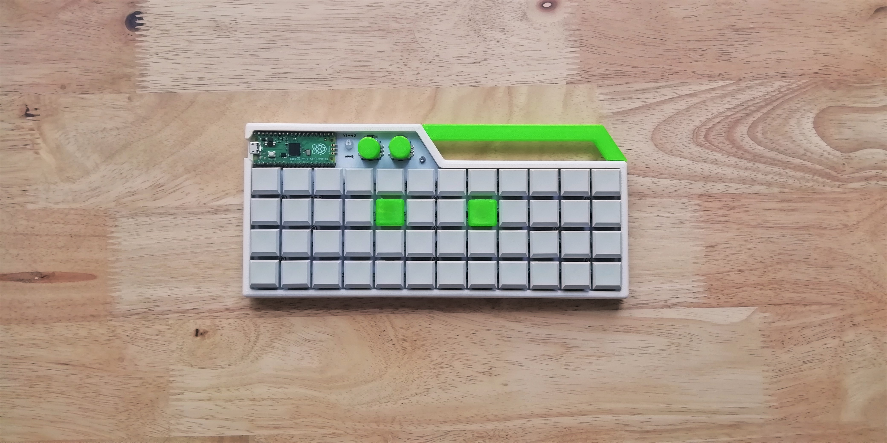

# VT-40
40% ortholinear mechanical keyboard



## Build info
PCB has Planck MIT layout and supports two rotary encoders and 2 RGB LEDs (which sadly don't work, because I'm bad at soldering xD). For switches I chose Kailh choc reds (lubed with 205g0), because I wanted to try low profile switches for a while. Case is 3D printed as well as F and J keycaps and knobs for rotary encoders. I also added a little buzzer to the bottom and modified KMK firmware to make it work, which was suprisingly pretty easy.

## KMK
[KMK firmware](https://github.com/KMKfw) is awesome. Since it’s based on circuitpython, you don’t need to install anything on your computer. You just plug it in, keyboard shows up as USB drive and you can edit python files which are stored there. It also has many features as QMK (RGB, BLE, split keyboards).
### Pinout
Key matrix:
```py
keyboard.col_pins = (board.GP6,board.GP7,board.GP8,board.GP9,board.GP10,board.GP11,board.GP12,board.GP13,board.GP21,board.GP20,board.GP19,board.GP18,board.GP22)
keyboard.row_pins = (board.GP2,board.GP3,board.GP4,board.GP5)
keyboard.diode_orientation = DiodeOrientation.COLUMNS
```
Encoders:
```py
encoder_map = [
    [
        (KC.VOLD,KC.VOLU,1),
        (KC.A,KC.B,1),
    ],
]
encoder_ext = EncoderHandler([board.GP26, board.GP16],[board.GP27, board.GP17], encoder_map)
```
My default layer:
```py
keyboard.keymap = [
	[
		KC.ESC,  KC.Q,    KC.W,  KC.E,   KC.R,  KC.T,   KC.Y,   KC.U,    KC.I,     KC.O,    KC.P,    KC.BSPC,  KC.MPLY,
		KC.TAB,  KC.A,    KC.S,  KC.D,   KC.F,  KC.G,   KC.H,   KC.J,    KC.K,     KC.L,    KC.GRV,  KC.LSFT(KC.BSLS),  KC.MUTE,
		KC.LSFT, KC.Z,    KC.X,  KC.C,   KC.V,  KC.B,   KC.N,   KC.M,    KC.COMMA, KC.DOT,  KC.UP,   KC.ENT,   XXXXXXX,
		KC.LCTL, KC.LALT, KC.MO(1),   KC.SPC, KC.MO(2), KC.SPC, KC.SPC, KC.RALT, KC.NO,    KC.LEFT, KC.DOWN, KC.RIGHT, XXXXXXX,
	],
 ...
]
```
Encoders buttons are wired to 13. column of key matrix, so you can change their behaviour on different layers.

## PCB
PCB supports CHOC, MX and ALPS switches. There are also 2 rotary encoders (EC11) and pads for two [TH WS2811 LEDs](https://www.aliexpress.com/item/32825363423.html?spm=a2g0s.9042311.0.0.47844c4dhfjDqT).
