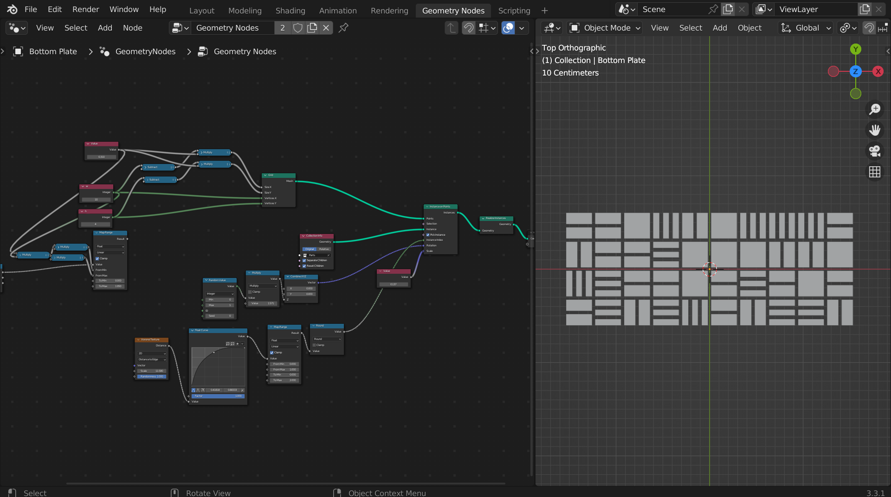
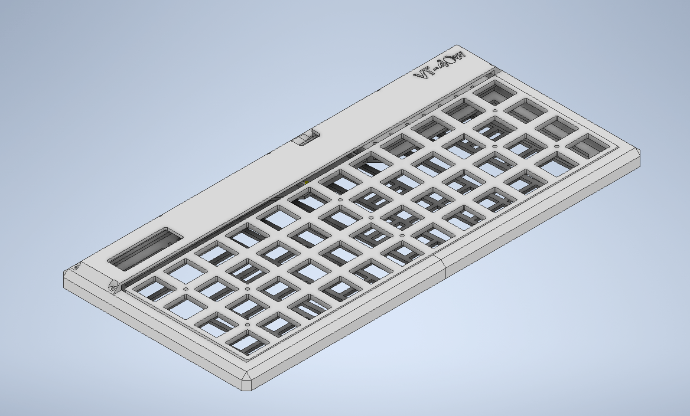

# VT-40w
Modified version of VT-40 PCB with IO expander and XIAO BLE microcontroller.

## Build
For a long time a wanted to build a wireless keyboard, and because I had few of the VT-40 PCBs laying around, I decided to modify it to work with a BLE capable microcroller.
For the microcontroller I chode XIAO BLE, which is new cheap uC with nrf52840. The only problem was that it only has 11 GPIOs and you need at least 16 GPIOs for Planck layout.
I decided to use IO expander MCP23017 which has 16 GPIOs and can communicate with uC via I2C.

I decided to make a small PCB for MCP23017 which would fit into space where RPi Pico is supposed to be. I also made a PCB for uC with pinheader for connecting IO Expaner and other periferals.

For the build I used KTT Seasalt Lemons lubed with Krytox 205g0. They are mounted on 2.5mm plate printed from black PLA and there's also foam between pcb and plate for better sound.

### Case design
Case was designed in Autodesk Inventor and is made out of 5 parts - 3 for the main frame, bottom with slight angle and top to cover all the electronics. 
The PCB is mounted with a little slides inside the main frame, so no screws are needed.

#### Randomly Generated pattern in Blender for bottom part
I decided to make bottom part i bit more interesting, so I generated random pattern of rectangles in Blender, and then imported it to Inventor.

  
&nbsp; &nbsp; &nbsp; &nbsp;
  

### Firmware
At first I wanted to try ZMK firmware, but because I could get the matrix working I decided to use KMK firmware. I also wrote a custom scanner for MCP23017.
